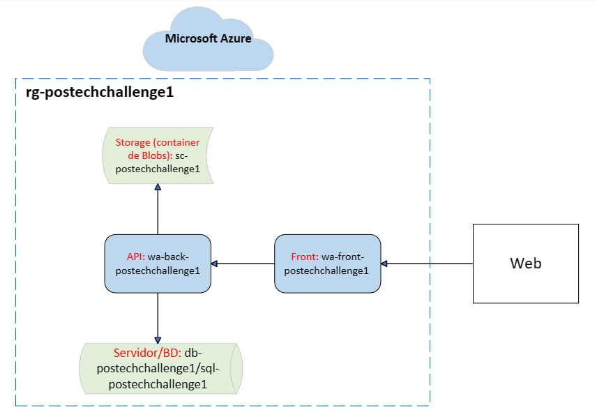
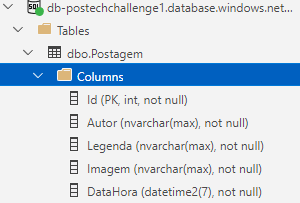

# PosgramWasm - FIAP Pós Tech

#### Especialização em Arquitetura de Sistemas .NET com Azure: Fase I - Tech Challenge

# 0. Metadados

**Nome do Projeto:** PosgramWasm

**Link da Aplicação:** https://wa-front-postechchallenge1.azurewebsites.net/

**Desenvolvedores do Projeto:**

| Aluno                               | RM            |  
| --------------------------------    | ------------- | 
| André Marinho Valadão Batemarchi    | 348471        | 
| Andre Vinícius de Angelo Falcão     | 349140        | 
| Kaique Leonardo Gomes da Silva      | 349128        |
| Nathalia Lasagna Dias de souza      | 350089        |
| Rodrigo Castagnaro                  | 349122        |

**Tecnologias Utilizadas:**

| Tecnologia                               | Propósito                              |  
| -----------------------------------      | -------------------------------------- | 
| Portal Azure e Azure CLI                 | Infraestrutura                         | 
| .NET 6                                   | API                                    | 
| ASP.NET 6, com Blazor                    | Front-end                              |
| Microsoft SQL Server 12                  | Banco de Dados                         |
| Visual Studio 2022 e VS Code             | Desenvolvimento                        |
| Azure Data Studio                        | Apoio ao Banco de Dados                |
| GitHub                                   | Versionamento e Deploy Automático      |
| Miro                                     | Planejamento das demandas do trabalho  |
| Figma                                    | Modelos de telas                       |
| Trello                                   | Kanban das demandas                    |
| Discord                                  | Comunicação da equipe                  |

# 1. Desafio

O Tech Challenge #1 consiste em desenvolver uma aplicação web com acesso a Banco de Dados (BD) e ao storage do Microsoft Azure. A ideia principal é que seja possível fazer upload de imagens na nuvem e recuperá-las (exibi-las) quando necessário.

**Requisitos:**

- A aplicação deve fazer uso de uma API com acesso a BD SQL Azure;
  
- As imagens deverão ser armazenadas no Azure Blob Storage;
  
- Todos os recursos criados na Azure devem ser hospedados em um mesmo Resource Group;
  
- A explicação da solução deve ser registrada em um vídeo e compartilhada no portal do aluno FIAP.

# 2. Nossa Solução

Definimos que criaríamos uma aplicação de mídia social. Os usuários da aplicação podem criar e visualizar postagens, na forma de imagens.

Para tanto, definimos que nossa aplicação precisaria de uma tabela para armazenamento de informações de postagens. Na tabela armazenamos o nome da imagem e em um container Azure armazenamos o Blob da imagem em base64.  Dessa forma, a API ficaria encarregada de se comunicar com o banco, o storage na nuvem e disponibilizar endpoints para consumo por parte do front-end.

## 2.1. Arquitetura Proposta

Para concretizar as ideias do grupo, usamos os recursos da Azure, de acordo com a seguinte arquitetura:

**Figura 1:** Arquitetura do PosgramWasm criada pelo grupo

De acordo com a Figura 1, a arquitetura do PosgramWasm é descrita pelos itens a seguir:

1. A partir da infraestrutura do Microsoft Azure, agrupamos logicamente os recursos no Resource Group *rg-postechchallenge1*.
2. O recurso de web app do front-end recebe uma requisição da web.
3. O front-end consome a API do recurso de web app do back-end.
4. A API faz o CRUD de postagens de mídia social usando o recurso de servidor de BD e o recurso de container para armazenamento de Blobs.
5. O resultado é verificado pelo usuário em seu navegador.

Por fim, apresentamos a entidade que representa a tabela Postagem do BD criado:

**Figura 2:** A Entidade Postagem criada pelo grupo

## 2.2. Explicação dos Recursos

Para os nomes dos recursos, buscamos seguir a convenção que identifica os recursos por meio das duas primeiras letras de seu tipo seguidas por hífen. Uma exceção é o Storage Account, que não permite usar hífen.

Utilizamos os recursos no nível/tier mais básicos e a localidade Brazil South.

Para fins de padronização, ambos os recursos de web app criados usam o runtime .NET v6, atualmente Long Term Support.

A seguir, definimos a função de cada recurso em nossa solução:

- Resource Group: **rg-postechchallenge1** - organiza logicamente todos os recursos.
  
- Storage Account: **sapostechchallenge1** - nosso namespace para trabalhar com Blobs.

- Container: **sc-postechchallenge1** - container onde são armazenados os Blobs (imagens) da aplicação.

- Service Plan: **sp-postechchallenge1** - nosso serviço para uso de recursos do tipo web app.

- Web App do front-end: **wa-front-postechchallenge1** - usado para publicar nosso front-end com ASP.NET 6 e Blazor.

- Web App do back-end: **wa-back-postechchallenge1** - usado para publicar nossa API com .NET 6.

- Servidor SQL: **db-postechchallenge1** - nosso servidor de BD.

- BD SQL: **sql-postechchallenge1** - o BD em si, contendo a tabela *Postagem*.

## 2.3. Código Desenvolvido

Para elucidar o código desenvolvido, fornecemos as informações a seguir, de cada pasta deste repositório. Observação: utilizamos uma Solution, contendo um projeto de API, um projeto Web e um projeto class library para infraestrutura.

**Pasta Api:**

- Contém os Controllers, Services, Repositories e Models/DTO.

- Os Services criados permitem realizar o upload da imagem em base64 na nuvem Azure.

- Os endpoints fornecem as funcionalidades de um CRUD de Postagens.

- A API é documentada com o Swagger.

**Pasta Infraestrutura:**

- Contém as configurações de BD.
  
- Possui o migrations da entidade *Postagem* realizado para o BD na Azure.

**Pasta WebBlazor:**

- Contém os arquivos das páginas HTML, CSS e razor.

- Página *login*: entrada do usuário na aplicação (recebe imagem de avatar e nome).
  
- Página *index*: mostra as postagens (exibe foto, autor, legenda, data e hora).

- Página *NewPost*: cria novas postagens (recebe foto e legenda).

**Pasta .github/workflows:**

- Contém os .ymls utilizados para realizar deploy automático da aplicação na nuvem Azure com GitHub Actions.

**Pasta res:** recursos usados por este documento.

**Outras pastas:** armazenam informações de configurações das IDEs utilizadas.

# 3. Azure - Comandos e Configurações Utilizados

Listamos aqui os comandos e configurações que usamos para publicar nossa solução na Azure. Observação: senhas/chaves/tokens foram censurados por questões de segurança.

- Resource group:

az group create --name rg-postechchallenge1 --location brazilsouth

- Storage account:

az storage account create --name sapostechchallenge1 --resource-group rg-postechchallenge1 --location brazilsouth --sku Standard_LRS

- Container para Blobs:

az storage container create --name sc-postechchallenge1 --account-name sapostechchallenge1 --account-key MINHA_CHAVE_FIAP

- Service Plan:

az appservice plan create --name sp-postechchallenge1 --resource-group rg-postechchallenge1 --sku F1 --location brazilsouth

- Web App - front-end:

az webapp create --name wa-front-postechchallenge1 --resource-group rg-postechchallenge1 --runtime "dotnet:6" --plan sp-postechchallenge1

- Web App - back-end:

az webapp create --name wa-back-postechchallenge1 --resource-group rg-postechchallenge1 --runtime "dotnet:6" --plan sp-postechchallenge1

- Servidor SQL:

az sql server create --name db-postechchallenge1 --location brazilsouth --resource-group rg-postechchallenge1 --admin-user fiappostech --admin-password senhaDoBD

- BD SQL:

az sql db create --resource-group rg-postechchallenge1 --server db-postechchallenge1 --name sql-postechchallenge1 --service-objective S0 --zone-redundant false --backup-storage-redundancy Local

- Configurações Adicionais:
  - No IAM, atribuímos o papel de *Owner* sobre o Resource Group para todos os devs do projeto.
  - No IAM, atribuímos o papel de *Storage Blob Data Contributor* para manipulação dos Blobs.
  - No container, criamos um Shared Access Token com datas e permissões específicas para acesso controlado aos Blobs.
  - No servidor de BD, usamos uma regra de liberação por IP do firewall para acesso e migrations do BD. Habilitamos também a opção *Allow Azure services and resources to access this server*.
  - Usamos a Connection String ADO.NET para o BD, com usuário e senha de acesso.
  - Habilitamos o CORS (no recurso de web app da API) para o endereço do front-end.

# 4. Conclusões

Este repositório apresenta um projeto de mídia social para compartilhamento de imagens que utiliza o .NET e a nuvem Microsoft Azure. Percebemos a robustez e a praticidade de se publicar uma aplicação desse tipo na Azure. Com uma arquitetura simplificada, pudemos superar o desafio proposto.

# 5. Referências

1. [Architecting Modern Web Applications with ASP.NET Core and Microsoft Azure](https://dotnet.microsoft.com/en-us/download/e-book/aspnet/pdf)

2. [ASP.NET Core Blazor](https://learn.microsoft.com/pt-br/aspnet/core/blazor/?view=aspnetcore-6.0)

3. [Quickstart: Azure Blob Storage client library for .NET](https://learn.microsoft.com/en-us/azure/storage/blobs/storage-quickstart-blobs-dotnet?tabs=visual-studio%2Cmanaged-identity%2Croles-azure-portal%2Csign-in-azure-cli%2Cidentity-visual-studio)

4. [Tutorial: Create a web API with ASP.NET Core](https://learn.microsoft.com/en-us/aspnet/core/tutorials/first-web-api?view=aspnetcore-6.0&tabs=visual-studio)

